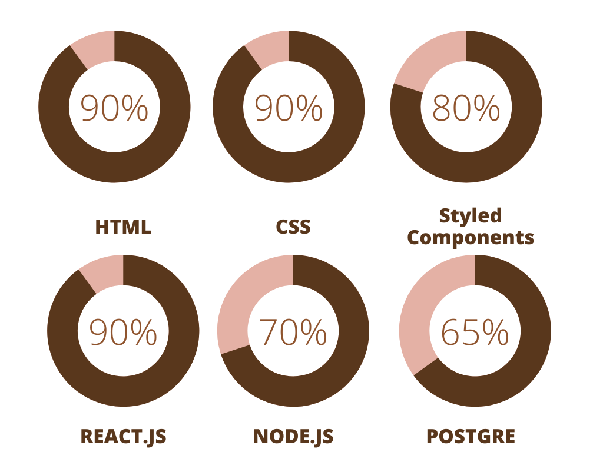

# Kanban task management web app

## Table of contents

- [Overview](#overview)
  - [Built with](#built-with)
  - [Screenshot](#screenshot)
  - [Links](#links)
  - [Author](#author)
  - [Skills](#skills)

## Overview

### About Project

This project took me about 1.5 week to finish. It's fully backed with a Node.js heroku server and ElephantSQL/postgre database. I used a Desktop-first workflow and I used Styled-Components as a CSS framework

### Built with

- Semantic HTML5 markup
- CSS
- Flexbox
- CSS Grid
- Desktop-first workflow
- Webpack
- [React](https://reactjs.org/) - Frontend framework
- [Styled Components](https://styled-components.com/) - For styles
- [Node.js](https://nodejs.org/) - Backend framework
- [ElephantSQL/Postgre](https://www.elephantsql.com/) - PostgreSQL Database

### Screenshot

![Desktop-Board[Dark]](./screenshots/screenshot-1.jpg)
![Desktop-Empty[Dark]](./screenshots/screenshot-2.jpg)

### Links

- Project Repo URL: [https://github.com/Abrham007/kanban-task-management-app.git](https://github.com/Abrham007/kanban-task-management-app.git)
- Live Site URL: [https://kanban-task-management-app-d2fe74b1db54.herokuapp.com/](https://kanban-task-management-app-d2fe74b1db54.herokuapp.com/)

### Author

- Website - [Abrham Araya](https://www.your-site.com)
- Github - [Abrham007](https://github.com/Abrham007)
- Stackover-flow - [Abrham Araya](https://stackoverflow.com/users/22762463/abrham-araya)

### Skills

